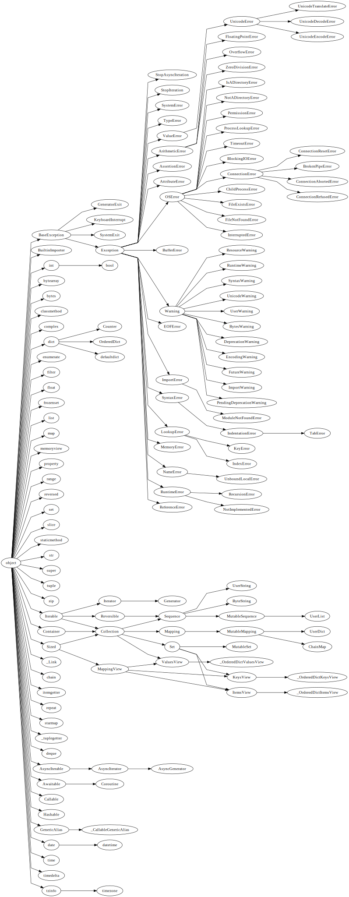

# Python Type-Hierarchy to Graphviz Generator

This Python module generates a Graphviz-compatible formatted graph that
represents the type hierarchy of all the classes in the specified Python
modules.

Tested on Python 3.7 only.

## Usage

```python
import type_to_graphviz

# Generate a type hierarchy graph for built in classes only.
type_to_graphviz.generate_graphviz(__builtins__)

# Generate a type hierarchy graph for built in classes and for the collections
# and abstract collections modules.
import collections
type_to_graphviz.generate_graphviz(__builtins__, collections, collections.abc)
```

Save the output to a file or copy and paste it into an online Graphviz renderer
such as [WebGraphviz](http://webgraphviz.com/).

Executing the file directly will generate a graph for built in classes,
and the `collections`, `collections.abc`, and `datetime` modules.


